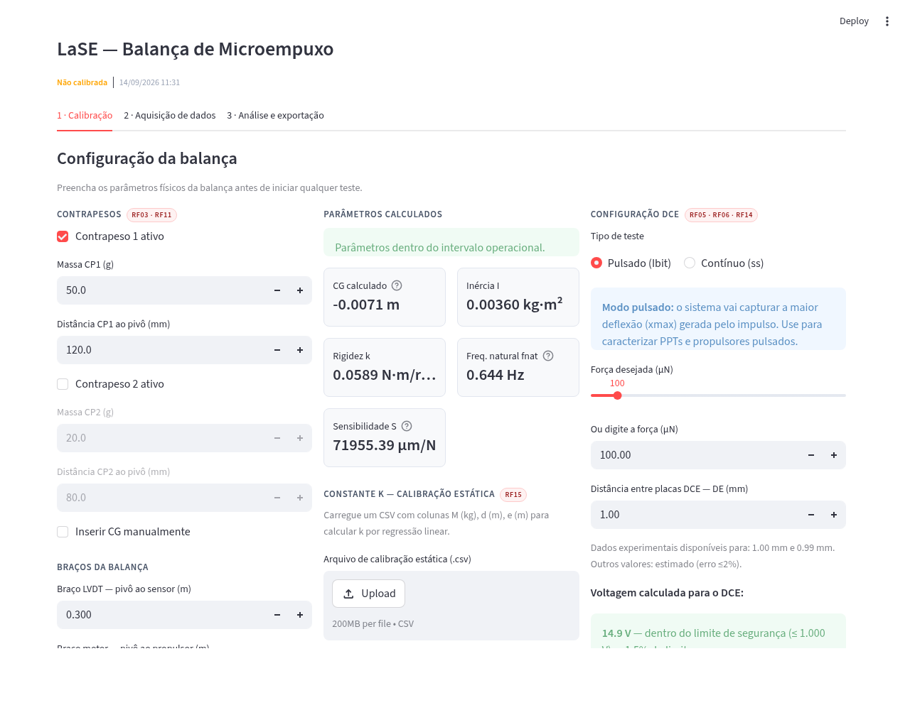

# Integrated Software Architecture for Micro-Thrust Balance

> Pipeline digital de quatro camadas para automação metrológica e tratamento de ruídos em bancadas de microempuxo 

[](https://python.org)
[](https://streamlit.io)
[](LICENSE)

---

## Visão Geral

Este repositório contém a arquitetura de software desenvolvida no **Laboratório de Sistemas Espaciais (LaSE)** da Universidade de Brasília (UnB) para caracterização precisa de sistemas de micropropulsão.

A arquitetura é estruturada em um **pipeline digital de quatro camadas** implementado em Python, integrando análise espectral (FFT), filtragem Butterworth de quinta ordem com fase zero, Filtro de Kalman sintonizado em Gêmeo Digital, gerenciamento metrológico de dados e interface Streamlit para telemetria e geração automatizada de relatórios PDF institucionais.



---

## Estrutura do Repositório

```
Integrated-Software-Architecture-for-Micro-Thrust-Balance/
│
├── Análises/                        # Análises experimentais anteriores (LaSE)
│   ├── data/                        # Dados brutos dos experimentos
│   ├── resultados/                  # Resultados processados
│   └── src/
│       ├── Hector/                  # Scripts de análise (H. Gessini)
│       └── ...                      # Scripts de análise física
│
├── calibration/                     # Camada 3 — calibração e gerenciamento
│   ├── physics/                     # Modelos físicos da balança
│   │   ├── centro_gravidade.m       # Cálculo do centro de gravidade
│   │   ├── carga_constante.m        # Análise de carga constante
│   │   ├── carga_constante_derivaTermica.m
│   │   ├── efeitojoule.py           # Modelagem efeito Joule
│   │   ├── efeitojoule_2.py
│   │   ├── eletroima_forca.py       # Força eletromagnética
│   │   ├── forca_eletroima.m
│   │   ├── graph_calibracao.m
│   │   ├── movimento_nucleo.py      # Dinâmica do núcleo
│   │   ├── plot_carga_cte.m
│   │   ├── relatorio_calibracao.py
│   │   ├── restricao_geo_forca.py
│   │   ├── superficie_calibracao.m
│   │   ├── 2_modo_vibracao.py       # Análise de modos de vibração
│   │   └── calibracao.py
│   ├── find_deflection.py           # Análise de deflexão + incerteza GUM (importado por interface/main.py)
│   ├── k_calculation.py             # Constante de rigidez efetiva k (importado por interface/main.py)
│   ├── dce_calibration.py           # Calibração in situ via DCE (simulada, sem hardware validado)
│   └── pendulum-dynamic.py          # Modelo dinâmico do pêndulo
│
├── signal_processing/               # Camadas 1 e 2 — FFT + DSP
│   ├── fn_calculation.py            # Análise espectral FFT + detecção de fn (importado por interface/main.py)
│   ├── processing.py                # Filtro Butterworth 5ª ordem + Kalman + conversão µm→mN
│   └── simulator.py                 # Gêmeo Digital do sistema dinâmico
│
├── interface/                       # Camada 4 — interface e relatórios
│   ├── main.py                      # Aplicação Streamlit (entry point — abas de calibração, aquisição e análise/exportação)
│   ├── live_plot.py                 # Telemetria em tempo real (50 ms)
│   ├── report_pdf.py                # Gerador de relatório PDF bilíngue PT/EN
│   └── web/                         # Interface web alternativa (HTML/CSS)
│       ├── index.html               # Dashboard
│       ├── calibracao.html          # Página de calibração
│       ├── analise.html             # Análise e exportação
│       └── style.css
│
├── hardware/                        # Aquisição de dados
│   ├── data_acquisition.py          # Interface serial USB com LVDT
│   └── dce_power_supply.py          # Driver SCPI/USB da fonte do DCE (real + simulado)
│
├── tools/                           # Scripts auxiliares
│   └── LVDT_Plot_V2.py              # Identificação de deslocamento máximo (importado por interface/main.py)
│
├── docs/                            # Documentação técnica
│   └── balanca.md                   # Especificações da balança
│
├── requirements.txt                 # Dependências Python
├── .gitignore
└── README.md
```

---

## Instalação

### Pré-requisitos

- Python 3.9+
- pip

### Passos

```bash
# Clone o repositório
git clone https://github.com/lase-unb/Integrated-Software-Architecture-for-Micro-Thrust-Balance.git
cd Integrated-Software-Architecture-for-Micro-Thrust-Balance

# Instale as dependências
pip install -r requirements.txt

# Execute a interface principal
streamlit run interface/main.py
```

---

## Pipeline de Quatro Camadas

| Camada | Módulo | Função |
|--------|--------|--------|
| 1 — Análise Espectral | `signal_processing/fn_calculation.py` | FFT + janela Hanning → identificação de fn |
| 2 — DSP | `signal_processing/processing.py` | Butterworth 5ª ordem + filtfilt + Kalman |
| 2 — Gêmeo Digital | `signal_processing/simulator.py` | Modelo dinâmico para sintonização do Kalman |
| 3 — Calibração | `calibration/k_calculation.py` | Constante k, ajuste linear, R² |
| 3 — Metrologia | `calibration/find_deflection.py` | Deflexão + incerteza σ_d (GUM) |
| 3 — Pico de deflexão | `tools/LVDT_Plot_V2.py` | Identificação de xmax (regime pulsado) |
| 4 — Interface | `interface/main.py` | Streamlit: calibração, aquisição, análise (3 abas) |
| 4 — Telemetria | `interface/live_plot.py` | Monitoramento tempo real (50 ms) |
| 4 — Relatório | `interface/report_pdf.py` | PDF institucional bilíngue PT/EN, via ReportLab |

Os módulos das Camadas 1–3 (`fn_calculation.py`, `find_deflection.py`, `k_calculation.py`, `LVDT_Plot_V2.py`) funcionam tanto de forma independente (`python <script>.py`, para análise offline de um arquivo) quanto importados diretamente por `interface/main.py` — não há lógica duplicada entre o app e os scripts standalone.

---

## Guia de Módulos

Descrição do que cada arquivo da arquitetura faz e como ele se encaixa no pipeline. Não cobre `Análises/` (scripts históricos de experimentos anteriores do LaSE, fora da arquitetura de software mantida).

### `calibration/`

`find_deflection.py` calcula a deflexão (Δd) entre uma janela de baseline e uma janela de patamar, com incerteza combinada σ_c = √(σ₁²+σ₂²) (GUM). A função `calcular_deflexao()` é importada por `interface/main.py`, mas o script também roda sozinho (`python find_deflection.py arquivo.txt`) para uma análise offline com gráfico.

Rigidez efetiva k é assunto de dois módulos, dependendo da fonte de força usada na calibração. `k_calculation.py` faz isso a partir de massas conhecidas — regressão linear T(θ)=k·θ+a por mínimos quadrados, com R² pra validar o ajuste (`calibracao_estatica()`). `dce_calibration.py` faz o mesmo ajuste, mas trocando a massa pela força eletrostática do DCE (lei quadrática de placas paralelas, `forca_dce()`), varrendo voltagens e lendo a deflexão resultante em `calibrar_via_dce()`. Tem interlock de 1000V embutido, mas **só foi validado em simulação** até agora (`python dce_calibration.py`, com `FontePowerSupplySimulada`) — falta testar com a fonte/DCE/LVDT reais e ligar isso na interface Streamlit.

`pendulum-dynamic.py` ainda não tem implementação — só cabeçalho, reservado pras equações diferenciais da dinâmica do pêndulo (simples e 2º modo de vibração). E `physics/` guarda os scripts MATLAB/Python de modelagem física usados no dimensionamento da balança (efeito Joule, força eletromagnética, geometria do núcleo); não são importados pelo app, ficam como referência de cálculo.

### `signal_processing/`

`processing.py` é o núcleo de DSP do projeto e é importado por praticamente todo o resto (main.py, live_plot.py, fn_calculation.py, LVDT_Plot_V2.py). `apply_kalman_filter()` implementa o Filtro de Kalman linear de 2 estados (posição e velocidade) sintonizado pela frequência natural; `apply_lowpass_filter()` roda o Butterworth 5ª ordem fase-zero (`filtfilt`) seguido do Kalman; `convert_to_mn()` converte µm em mN; `calculate_metrics()` extrai bias, empuxo nominal e ruído RMS.

A frequência natural (fnat) sai de `fn_calculation.py`, via FFT (rfft) do sinal filtrado buscando o pico de maior magnitude — `calcular_fnat()`, importada por `interface/main.py` e também executável sozinha.

`simulator.py` é diferente dos outros: gera dados sintéticos de pêndulo amortecido (ruído + oscilação + degrau de empuxo) e escreve continuamente em `data.txt` respeitando o tempo real (`time.sleep`), pra testar `live_plot.py` sem hardware. Ninguém importa esse arquivo — `main.py` tem seu próprio gerador de simulação, em lote.

### `interface/`

`main.py` é o ponto de entrada da aplicação (`streamlit run interface/main.py`), com três abas: Calibração, Aquisição de dados e Análise/exportação. `report_pdf.py` gera o relatório PDF bilíngue PT/EN via ReportLab quando o botão "Gerar PDF" da aba 3 é clicado (`gerar_pdf()`). `live_plot.py` é uma ferramenta à parte — visualizador desktop standalone (matplotlib `FuncAnimation`, 50 ms) que lê um arquivo fixo via polling, não integrado ao app Streamlit. E `web/` é só um mockup estático em HTML/CSS/Chart.js, sem backend nenhum por trás.

### `hardware/`

`data_acquisition.py` lê a porta serial USB do condicionador do LVDT (baud rate 9600) e grava em `data.txt` no formato esperado pelos outros módulos. `dce_power_supply.py` é o par de classes usadas pela calibração via DCE: `RigolDP932U` fala SCPI de verdade com a fonte via PyVISA (não testada com hardware ainda), e `FontePowerSupplySimulada` imita a mesma interface sem precisar do equipamento.

### `tools/`

`LVDT_Plot_V2.py` identifica o xmax (maior deflexão absoluta) num sinal já filtrado — usado na análise do regime pulsado, exposto como `detectar_xmax()` e importado por `interface/main.py`.

---

## Publicação

**Arquitetura de Software Integrada para Automação Metrológica e Tratamento de Ruídos em Bancadas de Microempuxo**

Sessão 2 — Sustentabilidade, Educação, Ciência e Tecnologia | Formato: Presencial

**Autores:**
- Luana Carvalho de Almeida — 242004840@aluno.unb.br (UnB)
- Thamiris Thomazini Libard — 200043820@aluno.unb.br (UnB)
- Lui Txai Calvoso Habl — lui.habl@unb.br (UnB)
- Paolo Gessini (UnB)

**Palavras-chave:** micropropulsão · arquitetura de software modular · processamento digital de sinais · calibração eletrostática in situ · Gêmeo Digital

---

## Licença

[MIT](LICENSE) — uso, cópia, modificação e redistribuição livres, inclusive comercial, desde que mantidos os créditos.
